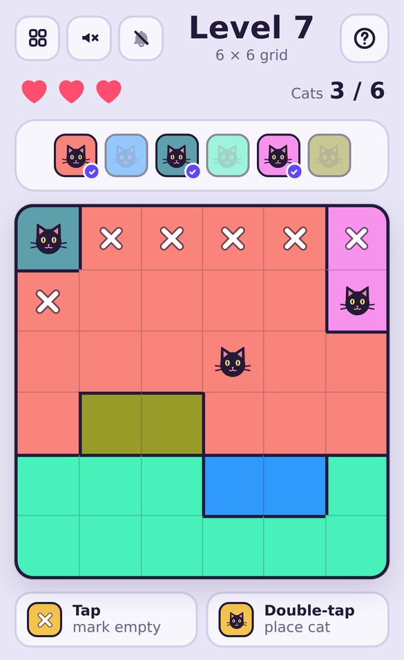

# 🐱 Whisker Hunt

**[▶ Play the game](https://hamiltonsteff.github.io/Whisker-Hunt/)**

A mobile-friendly, single-file HTML puzzle game in the style of *Meow Doku*. Find every hidden cat on the grid using logic alone — no guessing required.

## Play it

Whisker Hunt is a single self-contained `whisker-hunt.html` file — open it directly in any browser, or host it with GitHub Pages:

1. Upload `whisker-hunt.html` to a repo and rename it to `index.html`.
2. In the repo, go to **Settings → Pages**, set **Source** to **Deploy from a branch**, pick your branch and `/ (root)`, then **Save**.
3. Your game goes live at `https://<your-username>.github.io/<repo-name>/`.

No build step, no dependencies to install — it's one HTML file with everything inlined.

## How to play

- The grid is divided into colour-coded **territories**. Territories can be as small as one square, and every territory is one connected region.
- Hidden in the grid is exactly **one cat per territory** — and also exactly **one cat per row** and **one cat per column**.
- **Cats can never touch**, not even diagonally — every cat needs at least one empty square of buffer on all sides.
- **Single-tap** a square to mark it as empty with a white cross (tap again to clear it).
- **Double-tap** a square to guess a cat there:
  - Correct → a cat appears there.
  - Wrong → a red cross appears and you lose one of your **3 lives**. Lose all 3 and the level ends.
- A tracker strip above the grid shows one icon per colour — each one ticks off as you find that colour's cat, so you can see your progress and completion at a glance.
- Every puzzle has exactly **one solution**, and it can always be found by pure logic — never trial and error.

## Features

- **20 hand-picked levels** (4×4 up to 9×9), then **endless further levels** of random size up to **20×20**.
- Levels from 5×5–15×15 are generated on your device on demand; 16×16–20×20 come from a pre-built bank of puzzles (each reshuffled with rotation, mirroring and recolouring so repeats look different).
- A **zoom control** (1×/1.8×/2.6×) appears for grids of 11×11 and up, with directional arrows showing which way to scroll when part of the grid is out of view.
- Colours are chosen to be as visually distinct as possible; if two territories in a level still end up looking similar, one gets a subtle dot or stripe texture so they're never mistaken for a single merged territory.
- An optional **Auto ✕** toggle automatically marks squares that are provably empty once a cat is placed.
- **Whimsical background music** — a plucky, music-box-style tune with a soft bass pulse and a quiet purring texture — off by default, toggled with the speaker icon.
- **Sound effects** — a warning blip when a life is lost, a descending "fail" sound when all lives run out, a cat "meow" when you find a cat, and a celebratory ta-da when you find the last one — off by default, toggled independently of the music with the bell icon.
- All audio is generated in real time with the Web Audio API — there are no audio files, so the whole game stays one small HTML file.
- Light and dark mode support, safe-area-aware layout, and saved progress (via `localStorage`), so it plays well as a one-handed phone game.

## Built by prompting Claude

This game was built entirely through conversation with [Claude](https://claude.ai), iterating one feature at a time. Below is a single condensed prompt that captures everything we ended up asking for, so you (or anyone else) can hand it to an AI assistant and get a version of this whole game back in one shot.

Results will vary a little between runs and models — but the rules, structure and features below are the full spec.

> Build a single self-contained HTML file (playable by opening in a browser, and suitable for hosting on GitHub Pages) for a mobile-friendly puzzle game called "Whisker Hunt", similar to the app "Meow Doku".
>
> **Core rules:**
> - The grid is n×n, divided into n colour-coded territories (regions), one per colour. Territories can be as small as one square and vary in size within the same level; every territory must be a single contiguous (edge-connected) group of squares.
> - Hidden in the grid are n cats: exactly one per row, one per column, and one per colour territory.
> - No two cats may be adjacent to each other, including diagonally — every cat needs at least one empty square of buffer on all sides.
> - Every puzzle must have exactly one valid solution, and that solution must be reachable by pure logical deduction alone (no trial-and-error/backtracking required) — verify this with a solver before using a puzzle.
> - Single-tap a square to toggle a white "mark as empty" cross on it (no penalty).
> - Double-tap a square to guess a cat there. If correct, show a cat icon. If wrong, show a red cross and deduct one of 3 lives. Losing all 3 lives ends the level and reveals the correct cats.
> - Show a tracker strip above the grid with one icon per colour/cat; icons fill in with a checkmark as each cat is found, so progress and completion are visible at a glance.
>
> **Levels:**
> - Include a paginated level picker (~20 per page) showing each level's grid size, and, for completed levels, how many lives were left.
> - Provide 20 fixed hand-picked levels first (sizes from 4×4 up to 9×9), then continue with endless further levels of random size from 5×5 up to 20×20.
> - Generate levels 5×5–15×15 on-device on demand (with a brief "building your puzzle" loading state and background pre-fetching of the next level so it's rarely seen).
> - Ship a pre-generated bank of around 30 puzzles per size for 16×16–20×20, each reused with random rotation/mirroring and recolouring so repeats look different, since generating those sizes live is too slow.
>
> **Display:**
> - Add a zoom control (1×, 1.8×, 2.6×) that appears for grids 11×11 and larger (default to 1.8× on big grids), with a scrollable viewport. When zoomed in, show small directional arrows on whichever edges of the visible viewport currently have more hidden squares off-screen, updating live as the user scrolls.
> - Auto-assign each level's colours from a fixed palette chosen to be as visually distinct as possible; when two territories in the same level still end up similar, give one a subtle dot or stripe texture overlay so they're never confused as a single merged territory.
> - Give it a warm, rounded, playful visual style (e.g. a Fredoka-style Google Font with a system fallback), support light and dark mode via `prefers-color-scheme`, and make it comfortable to use one-handed on a phone (big tap targets, safe-area padding, no page scrolling/zooming).
>
> **Extras:**
> - An optional "Auto ✕" toggle that, when a cat is correctly placed, automatically marks all squares that are now provably empty (same row/column/territory, or adjacent) with white crosses.
> - A looping background music track: a whimsical, playful little tune (e.g. a plucky music-box/pizzicato melody with a light bass pulse and a subtle purring texture) with some character nodding to cats. Default off, toggled via a speaker icon in the header, remembering the choice between visits; since browsers block audio until a user gesture, resume playback on the first tap after reload if the preference was on.
> - Sound effects, toggled independently of the music (separate icon, also default off and remembered): a short warning blip when a life is lost, a descending "sad trombone" fail sound when all lives are lost, a bright ascending "ta-da!" when a level is completed, and a playful cat "meow" whenever a cat is correctly found — except the very last cat in the level, where the ta-da plays instead.
> - Build all audio procedurally with the Web Audio API (oscillators, filters, envelopes) rather than audio files, so the game stays a single small HTML file.
> - Save progress between visits with `localStorage`.
>
> The whole thing must be a single `.html` file with everything inlined — CSS, JS, the puzzle generator, the pre-generated level bank, and the audio — so it can be dropped straight into a GitHub repo and served via GitHub Pages by naming it `index.html`.
